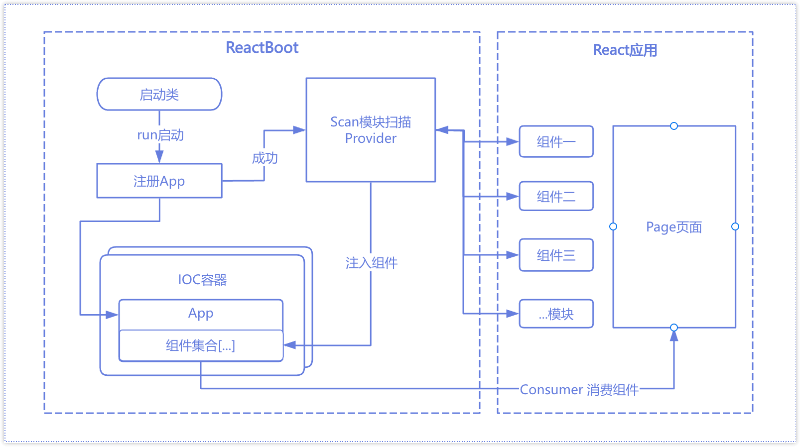

#### ReactBoot.JS NPM

<div align="center" 
     style="
        width: 100%; 
        height: 100px; 
        display: flex; 
        flex-direction:column; 
        justify-content: center; 
        align-items: center;">
            
            <h1 style="display: inline-block; font-size: 20px; line-height: 20px; font-weight: bold;">
                <b>react-boot</b>
            </h1>
</div>

<p align="middle">
    <a href="https://www.npmjs.com/package/@pjqdyd/npm-ts-demo" target="_blank">
        
    </a>
    
    
    
    
    
    
</p>

---

#### Background：
 #### “我们前端也要有自己的SpringBoot框架”

 该项目来源一个突发的灵感，Java后端的SpringBoot框架，通过简化配置、独立运行，集成IOC容器、依赖注入、控制反转、
 日志异常、微服务支持等功能，显著提高了后端开发的效率和便捷性，我想是否前端也需要有这样的框架，于是我开始设计并着手开发了.

 通过关注Java语法及Spring的一些特性，结合前端领域的知识，我构想了以下的一些技术方案和要点：
```
 1. TypeScript 、Class、Function
 2. React、TSX、SFC
 3. Vite、动态批量导入、path、env、import.meta
 4. 装饰器、注解、继承、抽象类、ICO容器，切面编程、依赖注入、控制反转
   （启动类，run方法、泛型、类型参数、自动推断、扫描的modules、reflect-metadata反射元数据、装饰器标识）
   （单例模式、模块/类实例导出、逻辑抽离、策略模式，定义接口规范，扩展点，日志异常系统）
 5. 类装饰器： @Application、 @Provider、@Consumer
 6. 函数Hooks：createApp、withProvider、useConsumer
 7. 应用卸载：destory
```
 技术架构图简示
 <br/>
 
 <br/>
 - 从架构图中可以看出ReactBoot目前版本的内容比较简单，只实现了上述方案中比较核心的功能.
 - 其中“组件”代表是任何可导出的模块类型（export default any）.
 - 从图中也可以看出，组件经过IOC容器后再由页面消费，这样做是否是多此一举，这也引发了我的一个思考：
   SpringBoot是因为Java需要频繁的创建和使用对象以及管理对象生命周期，所以将对象收集在IOC容器中集中管理和依赖注入, 
   那么React组件/JS对象会频繁的创建销毁吗？
   - 答案是会，但是这是keep-alive组件缓存/对象缓存应该解决的问题，已经有许多解决方案了，并且组件的生命周期管理都是由React或者你自己来控制.
 - 所以这个项目并不是为了减少React应用中组件的创建销毁次数，而是为了解耦页面和组件的硬连接 (松耦合)，
   这体现在容器中并不负责实例化具体的组件对象，实例化的过程交由React或者你自己的代码来完成，容器只管理你提供的任意可导出的模块引用，
   也就是说ReactBoot不关心具体的组件实例，而是关注到模块的引用.
 - 这样做有什么优势？或者说能利用这个特性来做些什么？
    - 可以用来做条件注入(多环境配置/权限控制)，比如：根据条件注入不同版本的组件、函数、对象等
    - 可以用来做公共模块的复用，比如：公共组件、公共方法、公共配置等
    - 实现插件系统，构建一个允许第三方扩展的应用程序时，可以动态/远程加载不同的组件或插件
    - 微前端场景中，主应用提供各种组件能力给各个子应用注入使用
    - 集中管理容器中的组件资源，提供模块的元数据分析/看板，比如：模块名称、版本、描述、依赖关系等
    - 等等其他使用场景
 - ReactBoot的核心与React应用是隔离的，也就是非侵入式接入，本项目是一个单独的ts npm包，可以在任何React应用中引入（理论上其他JS应用也行）.

   ##### 目前项目的功能不够完善，仍然处于Beta阶段，且没有详细的测试，切勿在生产项目中使用.
---

#### Install：
```
// npm 安装
npm install @pjqdyd/react-boot

// yarn 安装
yarn add @pjqdyd/ract-boot
```

#### How to use：
一. 在标准的Vite React项目中，构造如下目录结构的示例项目 [react-boot-demo](https://github.com/pjqdyd/react-boot-demo)：
```
 ├─public                        public目录
 ├─src                           源码目录
   ├─pages                       页面文件
     └─Home                      首页目录
       ├─types                   类型定义文件
       ├─async                   异步组件目录
         └─AsyncComponent.tsx    首页异步组件
       └─components              组件目录
         ├─HomeComponent.tsx     首页组件一
         └─HomeComponentTwo.tsx  首页组件二
       └─index.tsx               首页页面
   ├─router                      路由文件
   ├─utils                       工具类文件
     ├─Utils.tsx                 工具类一
     └─UtilsTwo.tsx              工具类二
   ├─main.tsx                    main.tsx入口文件
   ├─react-boot.ts               react-boot定义文件
   └─react-modules.ts            react-boot扫描的模块定义文件
 ├─index.html                    html文件
 ├─tsconfig.json                 tsconfig文件
 ├─vite.config.ts                vite配置文件
 └─package.json                  package.json文件
```

二. 编辑`react-boot.ts`文件，添加如下代码，用于定义react-boot的API及装饰器hooks：
```ts
import React from "react";
import { ReactBoot } from '@pjqdyd/react-boot'

const {
    createApp,
    Application,
    Provider,
    Consumer,
    withProvider,
    useConsumer,
    destroyApp
} = ReactBoot({
    react: React,
    name: 'app',
    description: '我的app',
    onload: () => {}
});

export { Application, Provider, Consumer, createApp, withProvider, useConsumer, destroyApp }
```

三. 编辑`react-modules.ts`文件，添加如下代码，用于定义需要扫描的模块范围
```ts
import { withProvider } from "@/react-boot.ts";
import type { Modules, AsyncModule} from "@pjqdyd/react-boot";

/**
 * 扫描的依赖模块
 * 同步导入 使用import.meta.glob {eager: true}
 * 异步导入 使用withProvider + import()
 */
const asyncComponent = () => import('./pages/Home/async/AsyncComponent.tsx');
// 导出模块
export const modules: Modules = {
    // 同步模块
    ...import.meta.glob(['./pages/Home/components/*.tsx'], { eager: true }),
    ...import.meta.glob('./utils/*.ts', { eager: true }),
    // 异步模块
    'AsyncComponent': withProvider<AsyncModule>({ name: 'AsyncComponent', isAsync: true })(asyncComponent),
};

export default modules
```
四. 在`main.ts`入口文件中，定义启动类的run方法，传入扫描的模块定义
```tsx
import React from 'react'
import ReactDOM from 'react-dom/client'
import { RouterProvider } from 'react-router-dom'
import { Application } from './react-boot'
import { ReactBootApplication } from '@pjqdyd/react-boot'
import Router from './router'
import './index.css'

import modules from "@/react-modules.ts";
// const modules = import('@/react-modules.ts'); // 模块定义动态导入

// 启动类
@Application({ modules: modules })
class App implements ReactBootApplication {
    run () {
        ReactDOM.createRoot(document.getElementById('root') as HTMLElement).render(
            <React.StrictMode>
                <RouterProvider router={Router} />
            </React.StrictMode>
        )
    }
}

```
五. 在需要注入的组件/工具类中，使用`@Provider`装饰器或者`withProvider`hooks来修饰定义，如下：
```tsx
import React, { Component } from 'react';
import { Provider } from "@/react-boot.ts";
import type { HomeComponentProps } from "@/pages/Home/types";

// 首页组件
@Provider({ name: 'HomeComponent' })
class HomeComponent extends Component<HomeComponentProps, never> {
    constructor() { ... }
    render() { ... }
}

export default HomeComponent;
```
```tsx
import React, { FunctionComponent } from 'react';
import { withProvider } from "@/react-boot.ts";
import type { HomeComponentProps } from "@/pages/Home/types";

// 首页组件2
const HomeComponentTwo = (props: HomeComponentProps) => {
    return ( ... );
}
export default withProvider<FunctionComponent>({ name: 'HomeComponentTwo' })(HomeComponentTwo);
```
```tsx
import { Provider } from "@/react-boot.ts";

// 工具类版本一
@Provider({ name: 'Utils', version: '1.0.0' })
class Utils {
    static getDate(): string {
        return new Date().toLocaleString()
    }
}

export default Utils
```
```tsx
import { Provider } from "@/react-boot.ts";

// 工具类版本二
@Provider({ name: 'Utils', version: '2.0.0' })
class UtilsTwo {
   static getDate(): string {
      return `${new Date().toLocaleString()} v2.0.0`
   }
}

export default UtilsTwo
```
六. 在需要使用组件的页面中，类组件中使用`@Consumer`装饰器，函数组件中使用`useConsumer`hooks来消费组件/工具类，如下：
```tsx
import React, { Suspense } from "react";
import viteLogo from "/vite.svg";
import reactBootLogo from "@/assets/react-boot.svg";
import { Consumer } from "@/react-boot.ts";
import type { UtilsType } from "@/utils/interface.ts";
import type { HomeComponentProps } from "@/pages/Home/types";

interface IState { visible?: boolean }

// 首页
class Home extends React.Component<never, IState> {

    @Consumer({name: 'HomeComponent'})
    private HomeComponent: React.ComponentClass<HomeComponentProps>;

    @Consumer({name: 'HomeComponentTwo'})
    private HomeComponentTwo: React.FunctionComponent<HomeComponentProps>;

    @Consumer({name: 'AsyncComponent'})
    private AsyncComponent: () => Promise<{ default: React.ComponentClass<HomeComponentProps> }>;

    @Consumer({name: 'Utils', version: '1.0.0'})
    private Utils: UtilsType

    @Consumer({name: 'Utils', version: '2.0.0'})
    private UtilsTwo: UtilsType

    constructor(props) {
        super(props);
        this.state = { visible: false }
    }

    componentDidMount() {
        // 未来某一时刻加载异步组件
        setTimeout(() => this.setState({visible: true}), 5000)
    }

    render() {
        const {
            HomeComponent,
            HomeComponentTwo,
            Utils,
            UtilsTwo,
        } = this;
        const AsyncComponent = React.lazy(this.AsyncComponent);

        return (
            <React.Fragment>
                <p>{Utils.getDate()}</p>

                <p>{UtilsTwo.getDate()}</p>

                <HomeComponent title="组件一"/>

                <HomeComponentTwo title="组件二"></HomeComponentTwo>

                {this.state.visible && (
                    <Suspense fallback={<div>loading...</div>}>
                        <AsyncComponent title="异步组件" />
                    </Suspense>
                )}
            </React.Fragment>
        );
    }
}

export default Home
```
运行启动项目后，访问Home首页：
<br/>

<br/>
总结：项目启动后会在控制台打印应用的启动信息、模块的加载及注入信息、模块组件的版本及使用信息。

---

#### All Methods：
class类中的方法：
```ts

/** 应用启动类装饰器 */
Application: (target?: ApplicationTarget) => any

/** 提供者装饰器 */
Provider: (params: ProviderParams) => (target?: ProviderConstructor) => void

/** 消费者装饰器 */
Consumer: (params: ConsumerParams) => (target: any, propertyKey: string, descriptor: Descriptor) => Descriptor
```
函数中的方法：
```ts
/** 创建应用启动函数 */
createApp: (options: AppOptions) => ReactBootApplication | void

/** 提供者hooks */
withProvider: <T>(params: ProviderParams) => (target: T) => T

/** 消费者hooks */
useConsumer: <T>(params: ConsumerParams) => T[]

/** 销毁应用函数 */
destroyApp: () => void
```
总结：更多详细代码请参考demo项目或者源码。

---
#### Key Questions 开发中遇到/解决的关键问题
- 模块扫描注入采用什么方案
    - 刚开始考虑过vite插件机制，通过扫描读取文件来注入模块，但这样可能会导致vite打包速度变慢，
      并且会额外增加使用成本，使用vite插件的局限性，如果要在webpack项目中使用还得提供webpack插件，
      最终采用了vite的import.meta.glob来扫描模块，通过动态批量导入的方式来注入模块,
      这样webpack项目的require.context也能够支持，加上装饰器和反射元数据来过滤需要注入的模块
- 如何保证加载模块和消费模块的顺序
    - 因为整个ReactBoot核心都是在运行时执行，那么只需要将模块加载的过程，放在run方法(启动react应用)之前同步执行就行了
- 如何解决加载模块循环依赖的问题
    - 使用Promise异步+生成器模式，保证模块在应用注册后，应用启动前加载，断开模块硬连接，在未来某一时刻加载模块，避免阻塞
- IOC容器采用什么方式来实现的
    - 采用了Map集合类型来作为容器，其中抽离出了App（应用）和Component（任意可导出模块组件）的概念来作为注入的对象，
- 如何在TypeScript中使用Reflect反射
    - TS的类型系统是静态的，类型信息只在编译时可用，而不会在JS运行时被保留，
      这与Java中可以通过反射机制在运行时获取类型信息有区别，虽然TS没有内置反射机制，
      但可以借助reflect-metadata库来实现元数据反射支持,
      元数据反射允许在类和属性上添加元数据，这些信息可以在运行时访问，通过结合装饰器来实现定义元数据
- 如何解决异步组件模块的异步加载问题
    - 这个目前没有想到很好的解决办法，因为扫描注入模块靠的是模块提供的元数据信息，而元数据是通过装饰器修饰在模块中的，
      一旦你获取到了元数据，也就意味着你加载了模块，这就是同步加载了，存在物理上的矛盾，
      所以要想不加载模块的前提下获取模块的元数据，那么只能通过外部配置定义的方式来，
      目前是提供了import() + withProvider这个hooks来定义异步模块的元数据
- TS编译后命名混淆，无法获取到class name，无法使用类名注入
    - 在Java中，可以通过类型自动注入依赖，比如：@Autowired、@Resource等，而在JS中只能使用命名注入，
      有点类似@Resource(name = "name")注入名称为name的Bean
- 类属性注入以及hooks注入采用什么方案
    - 类属性注入采用的是属性装饰器 + Object.defineProperty代理对象的get方法来实现的，hooks注入采用了React.useRef来缓存需要注入的值
- 日志模块自定义异常如何设计
    - 目前项目中实现了info|warn|error|system这四个级别的日志，可以控制日志的打印级别，自定义异常则是在内部继承Error来定义
- 如果你有更好的想法或意见，欢迎提issue/pr改进，欢迎大家一起参与开源，交流学习.

#### How to publish npm:
```
npm run build

npm login

// 发布@xxx私有包为公共, 使用--access publish
npm publish --access public
```

---

#### How to update npm:
1. change the version.
2. build.
3. npm publish.

---
#### License
This project is licensed under the [MIT](https://github.com/pjqdyd/npm-ts-demo/blob/master/LICENSE) license.
